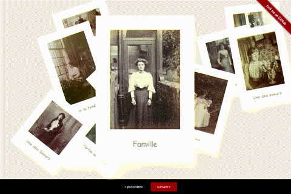

# polaroid-gallery

Javascript/CSS Polaroid Gallery - no dependencies

Automatically moves the selected photo into the middle of the screen while shuffling the others. Also provides a navigation which allows you to navigate between photos with next / prev buttons.

## Demo

https://rymbau.github.io/polaroid-gallery



## Usage

img directory contains images to display.

Add the JavaScript to the end of your document :

```javascript
<script type="text/javascript" src="js/polaroid-gallery.js"></script>
<script>
    window.onload = function () {
        new polaroidGallery("data/data.json"); //data/data.json contains images properties to display 
    }
</script>
```

### Configuration

Configure properties of images to display in data/data.json file :

* path : URL of file image
* caption : text below image
* description :  text description of flipped image


Example:

```json
[
{
"name": "img/img01.jpg", 
"caption": "En voiture",
"description": "Il a pour lui l'éternité, montre en main.<br> — Jules Renard"
},
{
"name": "img/img02.jpg",
"caption": "Amis",
"description": "Le temps confirme l'amitié.<br> — Henri Lacordaire"
}
]
```

## License 

MIT

## Contact

Authors : Rym BOUCHAGOUR & Emmanuel ROECKER

Web Development Blog - http://dev.glicer.com

